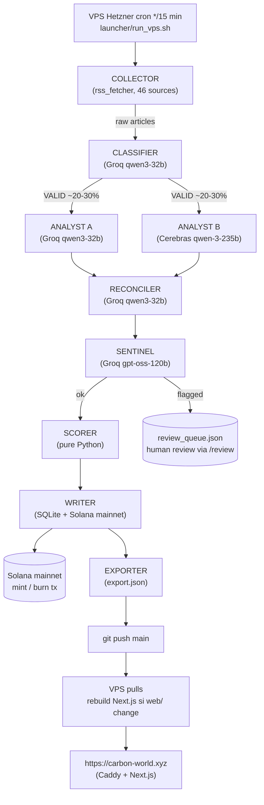
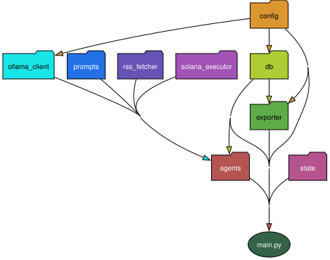
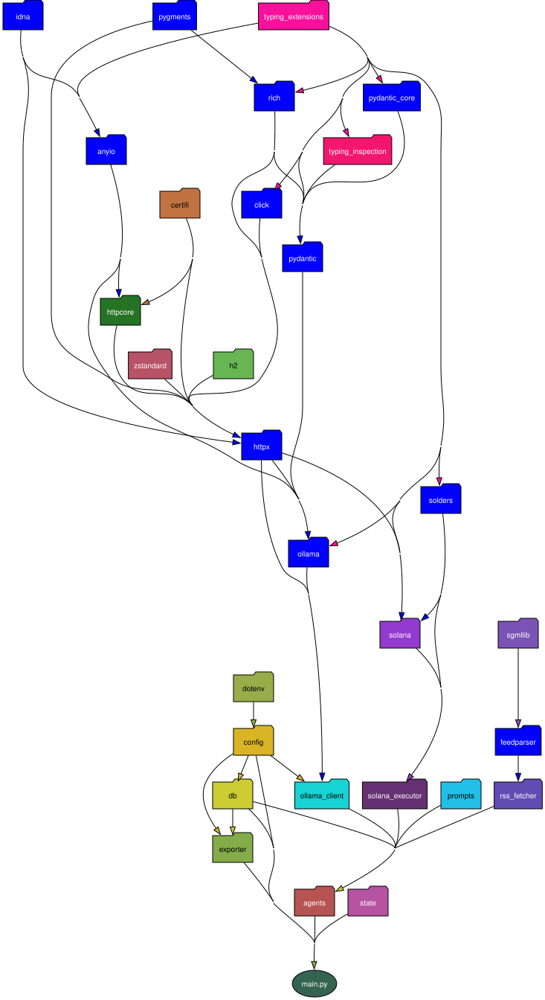

# Architecture CARBON WORLD

Cartographie du projet en 3 vues complémentaires : **pipeline logique** (Mermaid), **graphe des modules internes** (SVG), **graphe complet incluant les dépendances externes** (SVG).

---

## 1. Pipeline logique (vue fonctionnelle)



Provider LLM par agent : voir [CLAUDE.md](../../CLAUDE.md) section "Architecture technique" et la table multi-providers.

## 2. Graphe des modules internes

Vue architecturale du `worker/` Python : qui importe quoi, sans bruit des packages externes.



## 3. Graphe complet (internal + externes)

Inclut `httpx`, `ollama`, `solana`, `pydantic`, `feedparser`, etc. — utile pour auditer les dépendances tierces.



---

## Régénérer les graphes

Après tout refactor ou ajout de module :

```bash
bash docs/architecture/generate.sh
```

Requirements (une seule fois) :
- `brew install graphviz`
- `source venv/bin/activate && pip install pydeps`

Le script gère le workaround du tiret dans le nom de dossier (`CARBON-WORLD`) en stageant le code dans `/tmp` avant de passer pydeps.

## Pourquoi pydeps et pas autre chose

- **gitnexus** : licence PolyForm Noncommercial incompatible avec un projet qui peut devenir commercial.
- **tree-sitter-graph** : trop bas niveau, il faut écrire les règles d'extraction soi-même.
- **code2graph** : abandonné ou trop spécifique à certaines stacks.
- **pydeps** (BSD-2) : léger, maintenu, sort du SVG directement, pas de serveur, pas d'index à maintenir, ~30KB de dépendances. Parfait pour un worker Python de cette taille.

Pour le `web/` Next.js, ajouter [`madge`](https://github.com/pahen/madge) si la complexité TS augmente (il est simple aujourd'hui).
